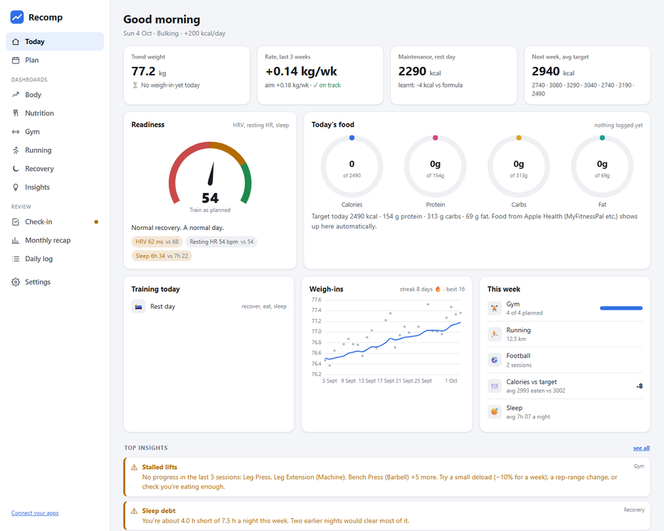
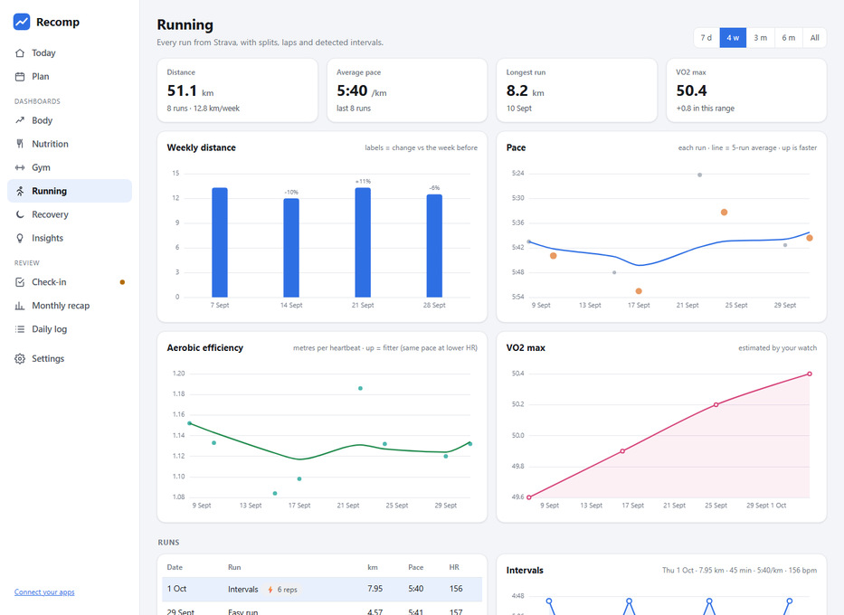
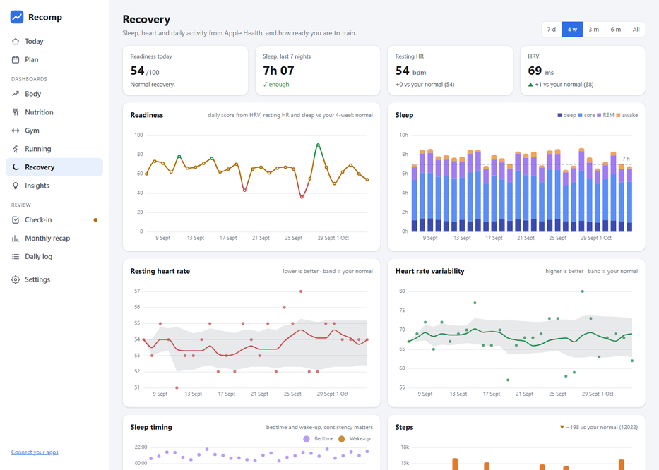
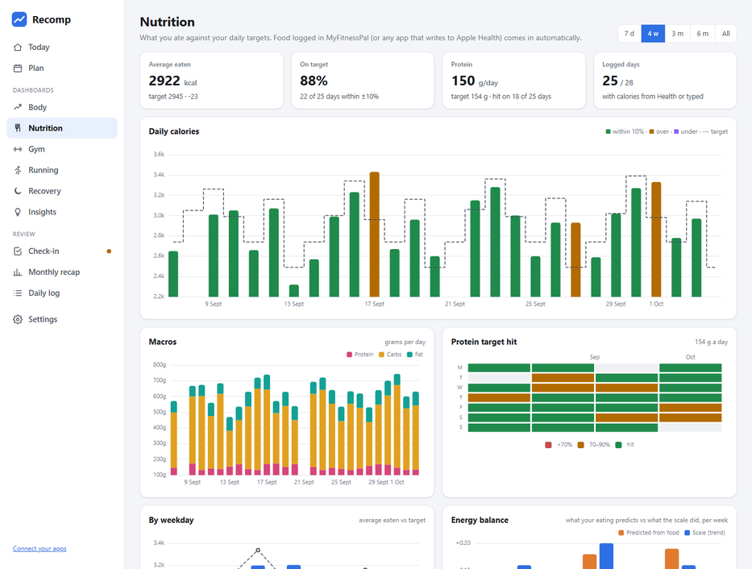
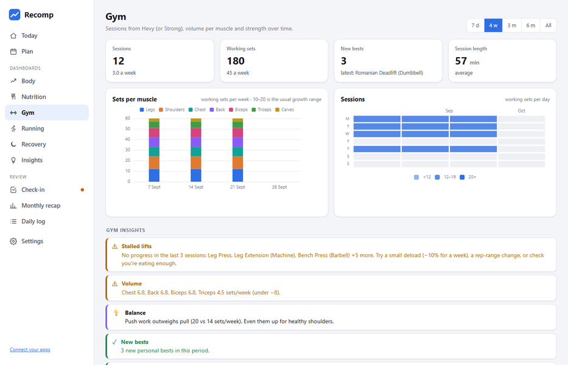
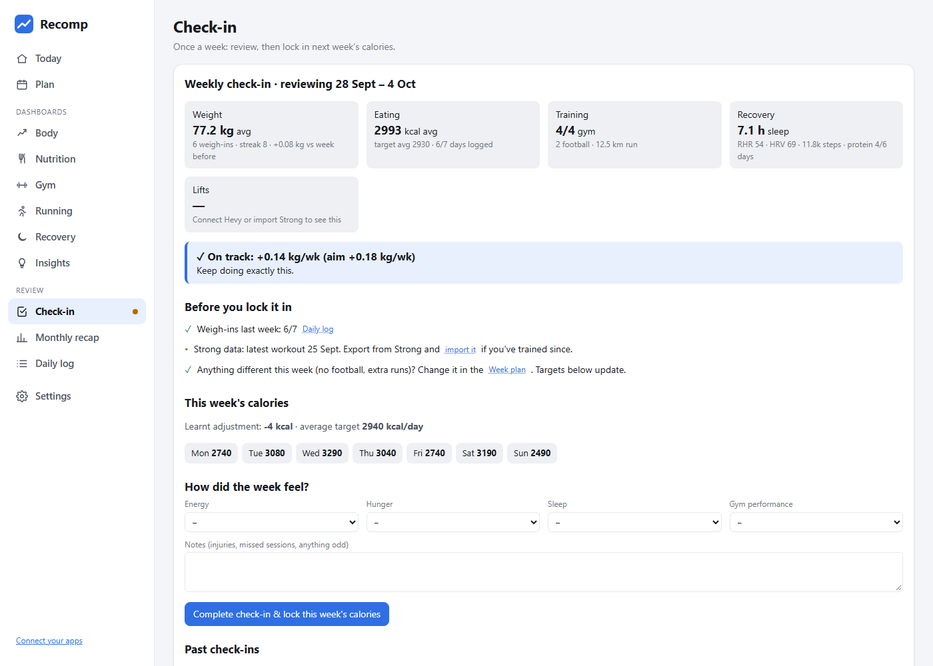
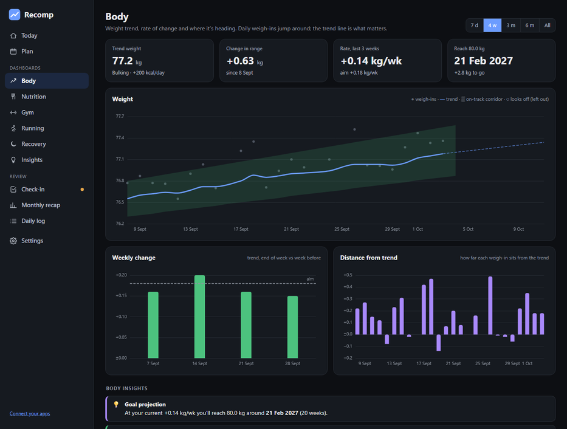

# Recomp

A small personal project, nothing serious. It's what I've been using to plan my calories and training around my own goals (gym, running and football). I've tidied it up in case it's useful to anyone else.

It works for **cutting, maintaining or bulking**. It sets each day's calories from what you're doing that day, smooths out daily weigh-in noise, and learns your real maintenance calories from your weight trend. A short weekly check-in locks in next week's numbers.

It's a static web page with no account and no server. Your data stays in your browser, plus an Excel backup file if you link one.

## Features

- **Today.** A readiness score from your HRV, resting heart rate and sleep, with advice for today's session. Calorie and macro rings for what you've eaten, your training with next-session targets, weigh-in streak and the most important insights.
- **Day-by-day targets.** Tick gym, sport training, match or a run distance on the week plan. Heavy days get more food and rest days get less, with macros for each day.
- **Learns your maintenance.** After about 2 weeks of weigh-ins and calorie entries, Recomp compares what you ate with what the scale did and corrects the formula. A weekly check-in locks in next week's numbers.
- **Dashboards for each area**, all with a shared date range (7 days to all time):
  - **Body:** weight trend with an on-track corridor, a projection to your target weight, and weekly change.
  - **Nutrition:** daily calories vs target, macros, a protein calendar, a weekday pattern, and energy balance (what your eating predicts vs what the scale did).
  - **Gym:** sets per muscle per week, a session calendar, a strength index, personal bests, e1RM per lift, and your split with set-by-set double progression.
  - **Running:** weekly distance with ramp warnings, pace and aerobic-efficiency trends, VO2 max, and every run with its splits, laps and **intervals detected from your pace**.
  - **Recovery:** readiness trend, sleep stages and timing, resting HR and HRV against your normal range, steps, active energy and breathing rate.
- **Insights everywhere.** Plain-English notes such as stalled lifts, mileage jumps, sleep debt, possible illness (resting HR and breathing rate both up), weekend eating and goal projection. A correlation finder spots your own patterns, for example "after nights under 6.5 h you ate ~300 kcal more".
- **Monthly recap.** Totals, highlights and habit scores for any month.
- **Syncs with** Apple Health (via Health Auto Export), Hevy and Strava. Strong CSV import and Excel/JSON backups are there too, switched on in **Settings → Connections**.
- **Metric or imperial**, any team sport (or none), and light/dark mode. Works on a phone too.

Screenshots use the built-in demo data.

| Running | Recovery |
|---|---|
|  |  |

| Nutrition | Gym |
|---|---|
|  |  |

| Weekly check-in | Body (dark mode) |
|---|---|
|  |  |

## Quick start

1. **Download** this repo (green **Code** button → **Download ZIP**) and unzip it.
2. **Open `index.html`** in **Chrome or Edge**. Other browsers work too, but auto-saving to Excel needs Chrome or Edge.
3. Fill in the one-minute setup, or click **Try with demo data** to look around first.

Keep the `css`, `js` and `lib` folders next to `index.html`.

You can also host it with GitHub Pages (**Settings → Pages → Deploy from branch**) and open it from a link. Data is still stored only in each visitor's own browser.

## How targets are calculated

1. **Base burn:** BMR (Mifflin–St Jeor) × a daily-life factor, from 1.25 for a desk job to 1.5 for a physical job.
2. **Plus training:** set calories per gym session, sport session and match, plus kcal per km of running. You can edit these, or use your watch's averages.
3. **Plus the learnt adjustment:** from the last 4 weeks of weigh-ins against logged calories (about 7700 kcal per kg), locked in at each check-in.
4. **Plus your goal:** a daily deficit, 0, or a surplus. You can start with maintenance weeks first to get a clean baseline.

Protein and fat are set per kg (or lb) of bodyweight, and carbs fill the rest.

**Tip:** the calorie box in the daily log is pre-filled with the target. If you roughly hit it, just save. Only type a number if you were well over or under.

## Connecting Strava (optional)

Strava only lets you connect through an API app of your own, so there are no shared keys in this repo.

1. Go to [strava.com/settings/api](https://www.strava.com/settings/api) and create an app. Set Website to `http://localhost` and **Authorization Callback Domain** to `localhost`.
2. In Recomp, go to **Settings → Connections**, switch on **Strava**, paste your Client ID and Secret, then click **Connect Strava**.
3. After you authorise, Strava redirects to a `localhost` page that won't load. That's expected. Copy that page's address back into Recomp.

The first sync pulls a year of activities. Runs also bring their per-km splits and laps, and opening a run on the **Running** page fetches its pace stream to detect intervals, even when your watch didn't record laps. After that it syncs whenever you open the page. Your Strava keys are stored in your browser only and are never written to backups.

## Connecting Hevy (optional)

Needs **Hevy Pro**, which is what gives access to Hevy's API.

1. Get your API key at [hevy.com/settings?developer](https://hevy.com/settings?developer).
2. In Recomp, go to **Settings → Connections → Hevy**, paste the key and click **Connect Hevy**.

The first sync pulls your whole workout history. After that, Recomp only fetches what changed (new, edited or deleted workouts) whenever you open the page. You can also tick **Also import weigh-ins** to bring in body weight logged in Hevy. It only fills days that don't have a weigh-in yet.

**One-tap morning weigh-ins:** make an iPhone Shortcut that asks for a number and saves it to Apple Health (**Log Health Sample → Weight**), and let Hevy read weight from Apple Health. Each weigh-in then goes from Health to Hevy to Recomp. Recomp checks for new weigh-ins whenever you open it or come back to the tab, and shows whether today's weigh-in has arrived. If you correct a weigh-in in Hevy, the correction comes through. A weight you type into Recomp is treated as manual and is never overwritten. A weigh-in that looks like a typo (far from your trend) is flagged and left out of the trend until you fix or confirm it. There's also a weigh-in streak on the Today page.

Moving from Strong? Hevy uses the same exercise names, so your Strong history and Hevy sessions line up. If you imported your Strong history into Hevy, Recomp spots the duplicates and keeps the Hevy copy. Your API key is stored in your browser only and never written to backups.

## Connecting Apple Health (optional)

Apple Health has no web API, so an iPhone app has to send the data. Recomp uses **[Health Auto Export](https://apps.apple.com/app/id1115567069)** (Premium) to post your Health data in the background to a tiny **relay you run for free on Cloudflare**, and Recomp collects it from there.

- **What comes in:** sleep, resting heart rate, HRV, VO2 max, steps, active and resting energy, weight, food calories and macros (from any food app that writes to Health, e.g. MyFitnessPal Premium), and workouts with their calories.
- **Your entries come first:** weights and calories you type yourself always win.
- **No double counting:** a workout that's also on Strava only counts once.
- **Where it shows up:** the **Recovery** dashboard and readiness score, food rings on **Today**, the **Nutrition** dashboard, and sleep and recovery in the weekly check-in.

**Setup (about 10 minutes, once):**
1. Cloudflare (free plan):
   - **Workers & Pages → Create application → Start with Hello World!**, name it `recomp-health`, then **Deploy**.
   - **Edit code**: paste in [`tools/health-relay-worker.js`](tools/health-relay-worker.js), then **Deploy**.
   - **Workers KV → Create instance**, then bind it to the worker as `HEALTH` (Bindings → Add binding → KV namespace).
   - **Settings → Variables and Secrets**: add a secret `RELAY_KEY`.
2. Recomp: go to **Settings → Connections → Apple Health**, enter the worker URL and key, then **Save & test**.
3. Health Auto Export: add a **REST API** automation pointing at `<worker>/ingest` with header `X-API-Key: <key>`, JSON v2, daily summaries, hourly. Then duplicate it with **Data Type: Workouts**, because each automation sends one data type.

Recomp walks you through each step and generates the key for you.

**Privacy:** data goes only to your own Cloudflare account and expires there after 21 days. iOS only lets apps read Health while the phone is unlocked, so updates arrive through the day as you use your phone.

## Importing Strong (optional)

In the Strong app, go to **Profile → Settings → Export Strong Data**, get the CSV onto your computer, then switch on **Strong CSV import** in **Settings → Connections** and import it. Re-importing only adds new workouts, so it never creates duplicates.

## Privacy

Everything stays on your device: browser `localStorage`, plus any Excel or JSON backup you save. The only network calls are to Strava, Hevy and your own Apple Health relay, and only if you connect them.

## Built with

Plain HTML, CSS and JavaScript, no build step. Charts use [Apache ECharts](https://echarts.apache.org/) (Apache-2.0, see `lib/LICENSE-echarts.txt`). The Excel import and export uses [SheetJS](https://sheetjs.com/) (Apache-2.0, see `lib/LICENSE-sheetjs.txt`).

## Licence

MIT. See [LICENSE](LICENSE).

Not medical advice. The estimates are a starting point, and your weight trend is the real judge.
