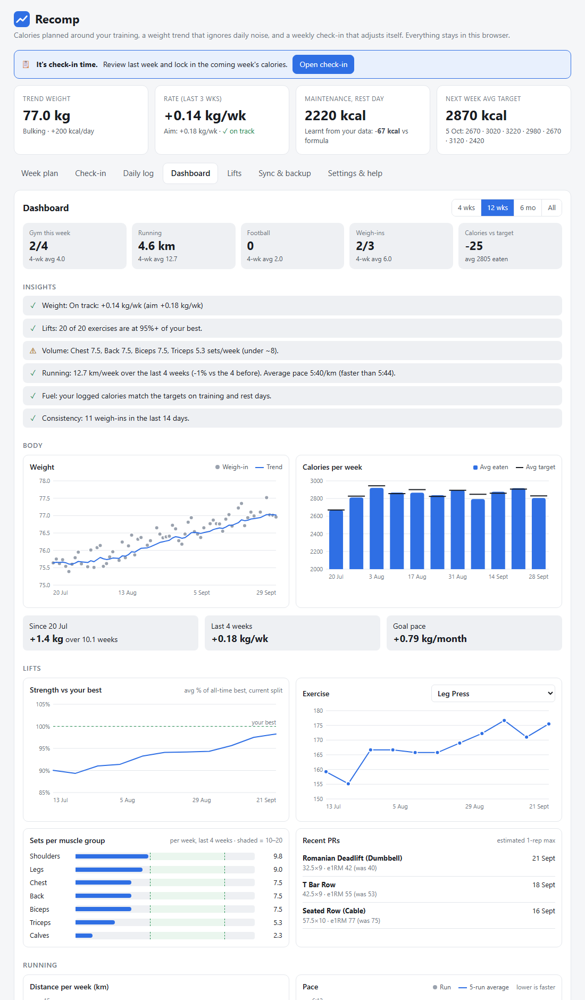
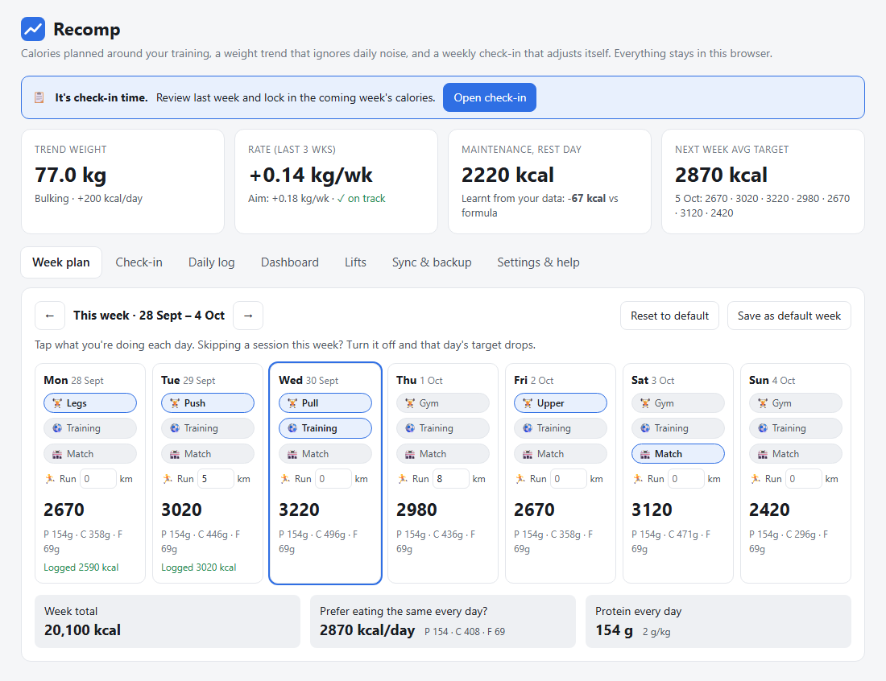
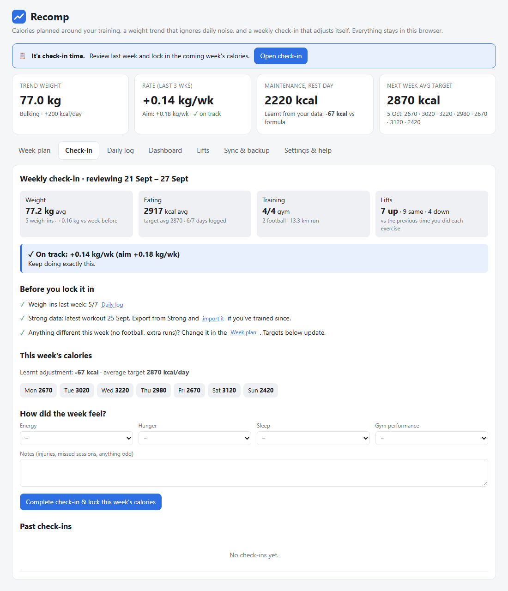
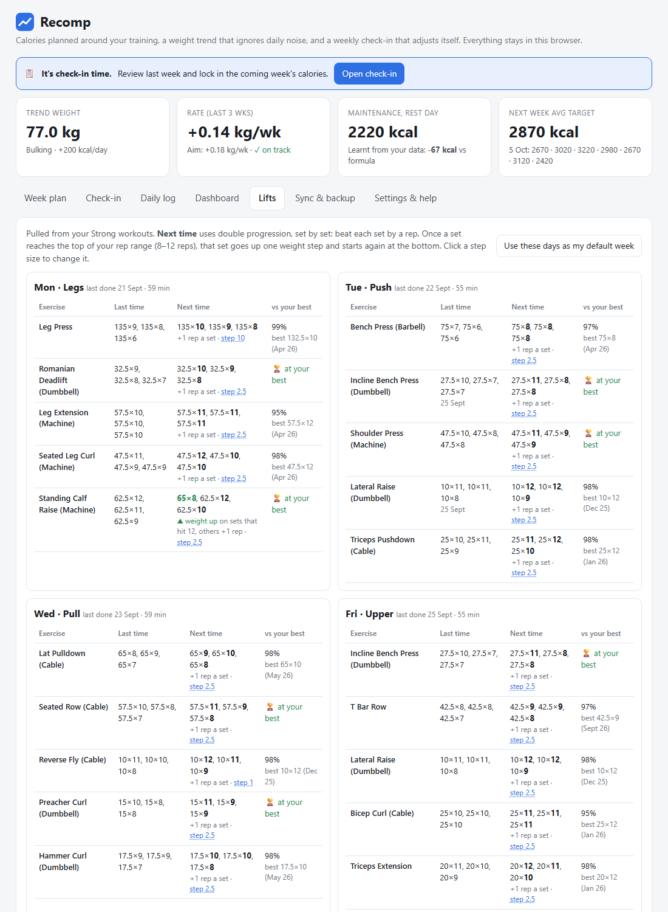
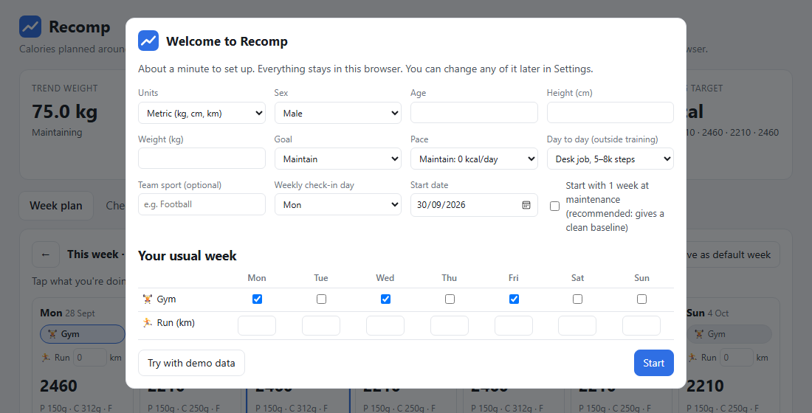

# Recomp

A small personal project, nothing serious. It's what I've been using to plan my calories and training around my own goals (gym, running and football). I've tidied it up in case it's useful to anyone else.

It works for **cutting, maintaining or bulking**. It sets each day's calories from what you're doing that day, smooths out daily weigh-in noise, and learns your real maintenance calories from your weight trend. A short weekly check-in locks in next week's numbers.

It's a single HTML file with no account and no server. Your data stays in your browser, plus an Excel backup file if you link one.

## Features

- **Day-by-day targets.** Tick gym, sport training, match or a run distance on the week plan. Heavy days get more food and rest days get less, with macros for each day.
- **Weight trend, not noise.** Daily weigh-ins are smoothed into a trend line, and your rate of change is compared with your goal.
- **Learns your maintenance.** After about 2 weeks of weigh-ins and calorie entries, Recomp compares what you ate with what the scale did and corrects the formula for you.
- **Weekly check-in.** Review the week (weight, eating, training, lifts), get a verdict against your goal, then lock in next week's calories so they don't drift mid-week.
- **Dashboard.** Weight and calorie trends, a strength index against your all-time bests, e1RM per exercise, sets per muscle group, recent PRs, running distance and pace, team-sport sessions, and plain-English insights.
- **Lifts from Hevy or Strong.** Hevy syncs automatically through its API, and Strong works via CSV import. Either way you see your split, next-session targets (set-by-set double progression) and how close you are to your best on every exercise. Hevy weigh-ins can come in too.
- **Runs and sport from Strava.** Anything on Strava (Apple Watch, Garmin, Coros…) is pulled in automatically, including watch calorie averages you can use for planning.
- **Excel backup.** Link a `.xlsx` file once and every change auto-saves to it, with Log, Weekly, Next session and Check-ins sheets. Edits you make in Excel can be restored back in.
- **Metric or imperial**, any team sport (or none), and dark mode.

Screenshots use the built-in demo data.

| Week plan | Weekly check-in |
|---|---|
|  |  |

| Lifts | First-run setup |
|---|---|
|  |  |

## Quick start

1. **Download** this repo (green **Code** button → **Download ZIP**) and unzip it.
2. **Open `index.html`** in **Chrome or Edge**. Other browsers work too, but auto-saving to Excel needs Chrome or Edge.
3. Fill in the one-minute setup, or click **Try with demo data** to look around first.

Keep the `lib` folder next to `index.html`, because it holds the Excel library.

You can also host it with GitHub Pages (**Settings → Pages → Deploy from branch**) and open it from a link. Data is still stored only in each visitor's own browser.

## How targets are calculated

1. **Base burn:** BMR (Mifflin–St Jeor) × a daily-life factor, from 1.25 for a desk job to 1.5 for a physical job.
2. **Plus training:** set calories per gym session, sport session and match, plus kcal per km of running. You can edit these, or use your watch's averages.
3. **Plus the learnt adjustment:** from the last 4 weeks of weigh-ins against logged calories (about 7700 kcal per kg), locked in at each check-in.
4. **Plus your goal:** a daily deficit, 0, or a surplus. You can start with maintenance weeks first to get a clean baseline.

Protein and fat are set per kg (or lb) of bodyweight, and carbs fill the rest.

**Tip:** the calorie box in the daily log is pre-filled with the target. If you roughly hit it, just save. Only type a number if you were well over or under.

## Connecting Strava (optional)

Strava only lets you connect through an API app of your own, so there are no shared keys in this repo.

1. Go to [strava.com/settings/api](https://www.strava.com/settings/api) and create an app. Set Website to `http://localhost` and **Authorization Callback Domain** to `localhost`.
2. In Recomp, go to **Sync & backup → Strava**, paste your Client ID and Secret, then click **Connect Strava**.
3. After you authorise, Strava redirects to a `localhost` page that won't load. That's expected. Copy that page's address back into Recomp.

The first sync pulls a year of activities. After that it syncs whenever you open the page. Your Strava keys are stored in your browser only and are never written to backups.

## Connecting Hevy (optional)

Needs **Hevy Pro**, which is what gives access to Hevy's API.

1. Get your API key at [hevy.com/settings?developer](https://hevy.com/settings?developer).
2. In Recomp, go to **Sync & backup → Hevy**, paste the key and click **Connect Hevy**.

The first sync pulls your whole workout history. After that, Recomp only fetches what changed (new, edited or deleted workouts) whenever you open the page. You can also tick **Also import weigh-ins** to bring in body weight logged in Hevy. It only fills days that don't have a weigh-in yet.

**One-tap morning weigh-ins:** make an iPhone Shortcut that asks for a number and saves it to Apple Health (**Log Health Sample → Weight**), and let Hevy read weight from Apple Health. Each weigh-in then goes from Health to Hevy to Recomp. Recomp checks for new weigh-ins whenever you open it or come back to the tab, and shows whether today's weigh-in has arrived. If you correct a weigh-in in Hevy, the correction comes through. A weight you type into Recomp is treated as manual and is never overwritten. A weigh-in that looks like a typo (far from your trend) is flagged and left out of the trend until you fix or confirm it. There's also a weigh-in streak on the dashboard.

Moving from Strong? Hevy uses the same exercise names, so your Strong history and Hevy sessions line up. If you imported your Strong history into Hevy, Recomp spots the duplicates and keeps the Hevy copy. Your API key is stored in your browser only and never written to backups.

## Importing Strong (optional)

In the Strong app, go to **Profile → Settings → Export Strong Data**, get the CSV onto your computer, then go to **Sync & backup → Import Strong CSV**. Re-importing only adds new workouts, so it never creates duplicates.

## Privacy

Everything stays on your device: browser `localStorage`, plus any Excel or JSON backup you save. The only network calls are to Strava and Hevy, and only if you connect them.

## Built with

Plain HTML, CSS and JavaScript in one file. Charts are hand-rolled SVG. The Excel import and export uses [SheetJS](https://sheetjs.com/) (Apache-2.0, see `lib/LICENSE-sheetjs.txt`).

## Licence

MIT. See [LICENSE](LICENSE).

Not medical advice. The estimates are a starting point, and your weight trend is the real judge.
